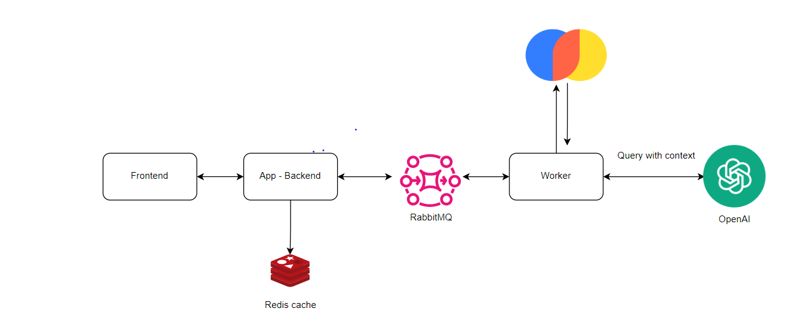
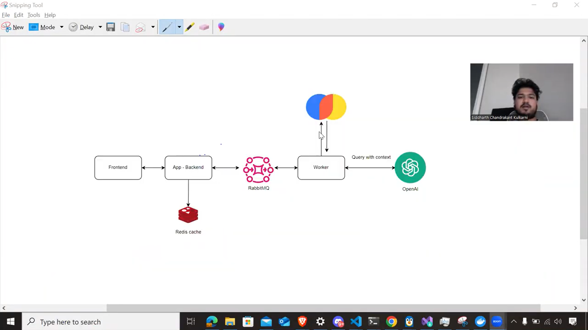

# Food security 2023/2024 Chatbot


## Architecture


- Worker       : Worker does the heavy lifting. It retrives similar data from vectorDB (Chroma DB)

- Backend App  : Its the app exposing backend API to frontend. It also updates results in redis cache

- Frontend     : Frontend interacts with backend-api and gives back the result

- Rabbit MQ    : Message queue has prompts and results channel through which backend and worker interact with for asynch communication.

- OpenAI API : We are using 'GPT-3.5-turbo' model and restricting the context with the information retreival done from vector DB

- Redis : To cache prompts and its result for faster response.

## Demo
[](https://drive.google.com/file/d/1P5t8N-9oJkPrU19s-h0xZrs_VoXp0qMc/view?usp=drive_link)

## How to run
### Prerequisites
Install following
1. Docker
2. Node.js
3. Python

### Run RabbitMQ and Redis in Docker :
```bash
cd  docker

docker-compose up -d
```


### To Run the Front End 
```bash
 cd frontend
 npm install
 npm start
```

### install pythin dependencies
```bash
 pip install -r requirements.txt
```
### To run worker
```bash
 python source/worker.py
```

### To run app
```bash
 python source/searchDB.py
```

### open frontend in browser :
open in browser :
http://localhost:3000/


